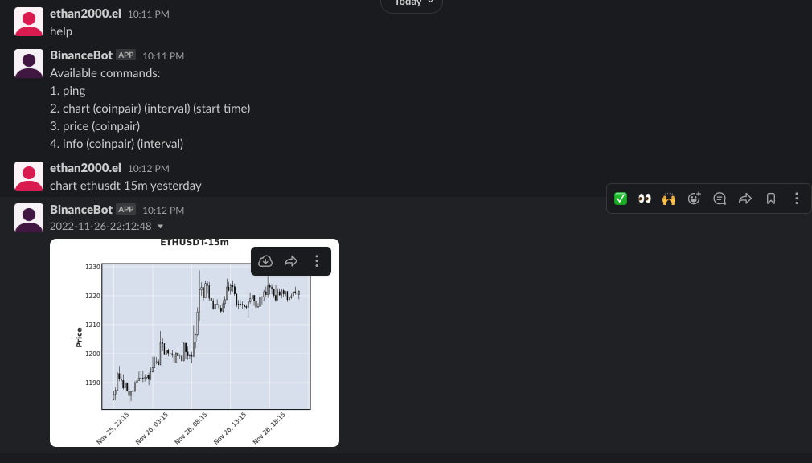

# BinanceBot

A simple bot utilising Binance API, Slack API, and MQTT to monitor the crypto market.


## 1. Prerequisite

### 1.1 Creating Binance Account
- Binance Key and Secret ([Details](https://www.binance.com/en/support/faq/how-to-download-and-set-up-binance-code-api-af014f44f45845debf79b4cf81333a25))

### 1.2 Creating Slack App
- First create a slack account
- [Create New App](https://api.slack.com/apps)
- Add features and functionality, select Event Subscriptions, Bots, and Permissions:

- Install your app
- **Signing Secret** is under App Credential

### 1.3 OAth & Permission of Slack App
- **Bot User OAuth Token**:


### 1.4 Event Subscription
- Go to Event Subscriptions -> Switch on Enable
- **Enter New Request URL when slackbot has started**:

**Remarks**: Remember to enter the request url when slackbot has started, because it will try to send a request to your server for verification.


### 1.5 Environment Variable
- Given that all the steps above were done
- Prepare .env file in the root directory
```bash
BINANCE_KEY={YOUR BINANCE KEY}
BINANCE_SECRET={YOUR BINANCE SECRET}
SLACK_EVENT_TOKEN= {YOUR SIGNING SECRET}
SLACK_TOKEN={Bot User OAuth Token}
```

## 2. How to Start

### 2.1 Docker environments
```
# Building docker images
make build

# Start development mode
make mode=dev start

# Start production mode
make mode=prod start
```

### 2.2 Slackbot
- Create a slack channel
- Type @{bot_name} to add the bot to the channel
- Send "help" -> the bot will reply all the available commands
- e.g. Want to see the chart of ETH/USDT pair with 15m interval, starting from yesterday -> type "chart ethusdt 15m yesterday"



### 2.3 Slack Commands Format
- Coin pair format:
    - ETH to USDT price -> ETHUSDT; ETH to BTC -> ETHBTC
    - Case insensitive: ETHSUDT = ethusdt = EtHUSdT
- Interval format:
    - Available in minutes and hours
    - e.g. 5m, 15m, 1h, 2h, 4h, 8h, etc.
- Start time format:
    - Any conventional date format
    - e.g., 25/7/2022, 5-November-2022, 25-10-2022, etc
